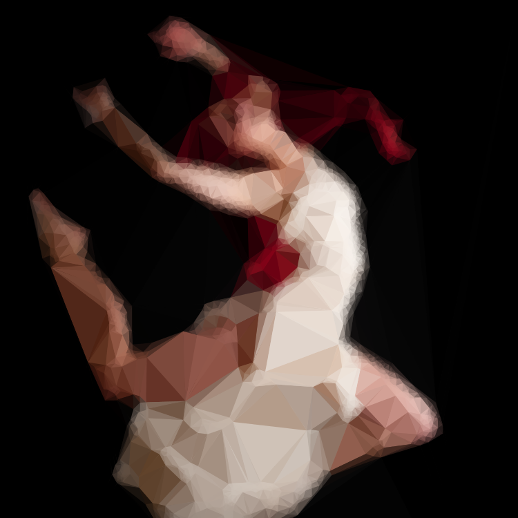
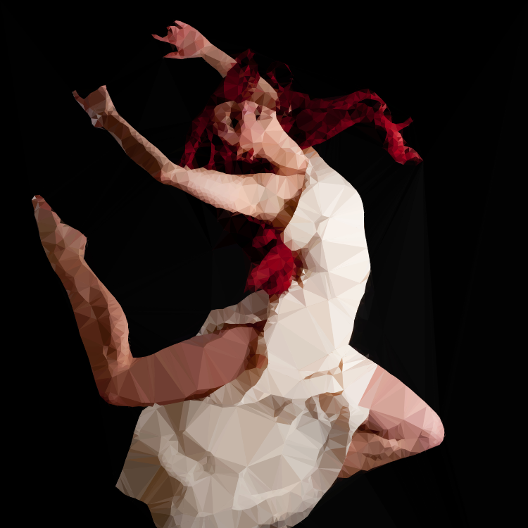
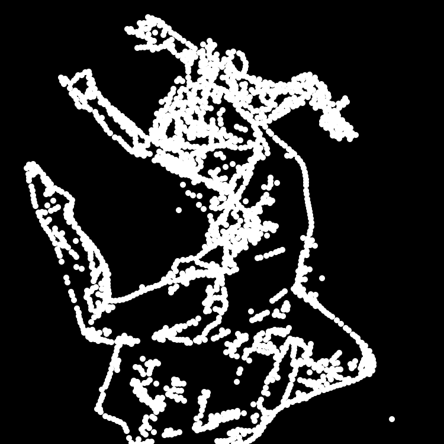
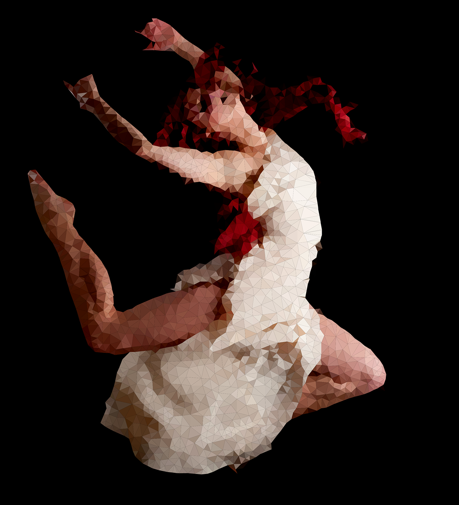
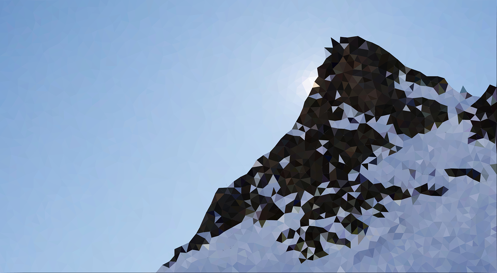
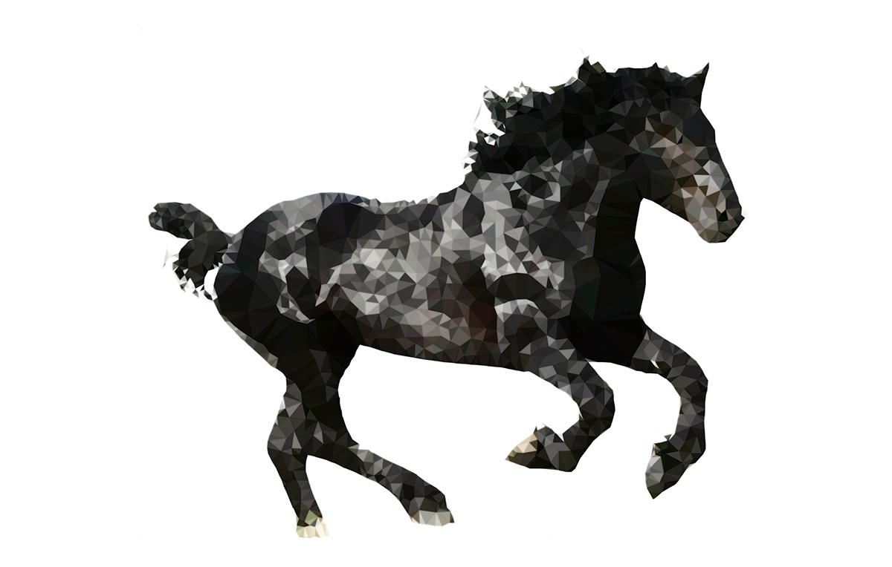
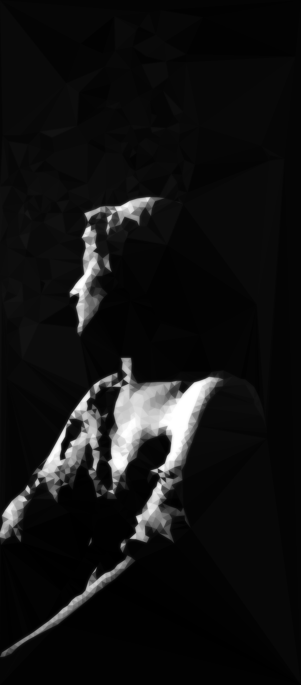

DelaunayRaster
==============

A script that tried to create a low poly 2D approximation of an image.
**Requires Toxiclibs.**

Algorithm
---------
(From my [Behance portfolio](https://www.behance.net/gallery/14180619/Automatic-Triangulation))

Approximating an image by a set of geometric shapes is a classic of Creative Coding. Some techniques use circles, squares, triangles... It is common to use a Delaunay triangulation and color the triangles in order to get a approximation of the image (the so-called "Low poly" style). There are many apps on the internet using this Delaunay triangulation and colored triangles to approximate the image. Usually, the points given to the triangulation are defined by the user. This work is an attempt to make the whole process completely automatic.

### Triangulation and rendering

Rendering is done using Processing, the Delaunay triangulation is done with the Toxiclibs library.

### Coloring the triangles

For each triangle of the motif, the centroid of the triangle is calculated. Afterwards, the triangle takes the color of the pixel in the source image which has the same coordinates as the centroid.

### Randomly adding points

It is fairly easy just to randomly add points. But more that 10 000 points are needed to get something that look like the source image.

### Max Delta

#### Base Idea

The effect looks a bit... blurry. By adding points, I want to improve the resulting image. A way of improving the result is to use something called "max delta". It relies on a simple idea. To find the max delta, I need to compare the source image and the destination image.  Then I add a point where the biggest difference between the source image and the destination image is. Iterate over the pixels, find the pixel where there is the biggest difference between source and destination image, insert a point here. That's it.
The algorithm runs by adding a point, triangulating, coloring, finding the Max Delta, start again.

### Insistance
The problem of the max delta technique is that if adding a point is not improving enough the destination image, the max delta will be the same pixel at the next iteration. The same point will be added over and over again, never improving the destination image.
To avoid that, when the max delta is found, the point is not added on it but next to it. To do so, a random jitter is added to the max delta.

The result is improved, however, it is almost mandatory to previously blur the image. Otherwise, there is still a lot of insistance on some points.

### Repulsion between points

A good way to avoid insistance was actually simply to forbid a point that has been already used. To do so, a solution would be to save every point added to the structure. The problem is that then, when seaching for the new point, it would be necessary to compare with all previous points. This is too slow, especially with more than 1000 points.
What I did was to use another image to save which pixels are forbidden. The image is all black in the beginning, and each time a point is added to the structure, a white circle (with an arbitrary radius), is drawn on the map. Then, when iterating through the image to find the max delta, the pixel is checked only if the pixel on the map is not white. If it is white, then this pixel is forbidden and therefore is not taken into account in the search of the max delta.

We can also see the map showing the forbidden pixels.

Results
-------

Controls
--------
Keyboard shortcuts, press keys during the program:

* **'d'**: Inject *maxPoints* points in the triangulation.
* **'c'**: Inject a number of random points in triangulation.
* **'r'**: Enables recording of screenshots (for video making).
* **'p'**: Prints out structure on a PDF.
